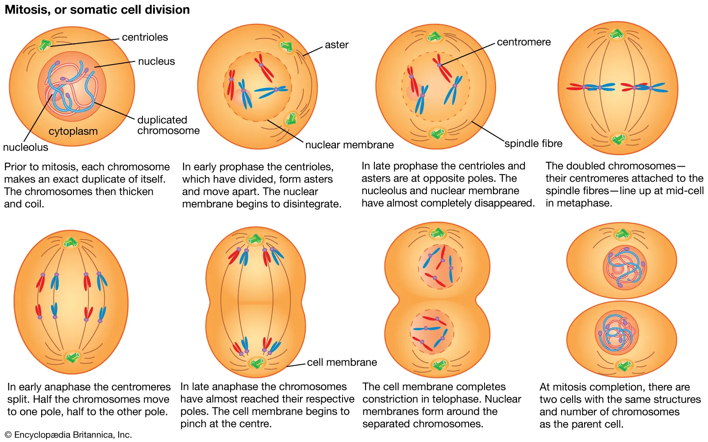

# Cell Division and Project Launch
[Читать на русском](./assets/README.ru.md)

## Cell Division

_Cell division is the process by which a single cell divides into two or more daughter cells. There are two main types of cell division:_

1. **Mitosis** – a process in which one cell divides to form two identical daughter cells. It consists of several phases:
   - Interphase
   - Prophase
   - Metaphase
   - Anaphase
   - Telophase
   - Cytokinesis

2. **Meiosis** – a special type of division in which a diploid cell produces four haploid cells, typically associated with sexual reproduction. It occurs in two sequential stages: Meiosis I and Meiosis II.



## Running the Project and Tests

To run the project, follow these steps:

### 1. Activate the Virtual Environment
The project uses **Poetry** for dependency management. If Poetry is not installed, install it using:
```bash
pip install poetry
```

Then, activate the virtual environment:
```bash
poetry shell
```

### 2. Install Dependencies
After activating the environment, install all dependencies:
```bash
poetry install
. .venv/bin/activate
```

### 3. Run the Project
Start the main script using:
```bash
python3.11 manage.py cell
```

### 4. Run Tests
To execute tests, use the following command:
```bash
python3.11 manage.py tests
```

The system will then run all tests and display the results.

